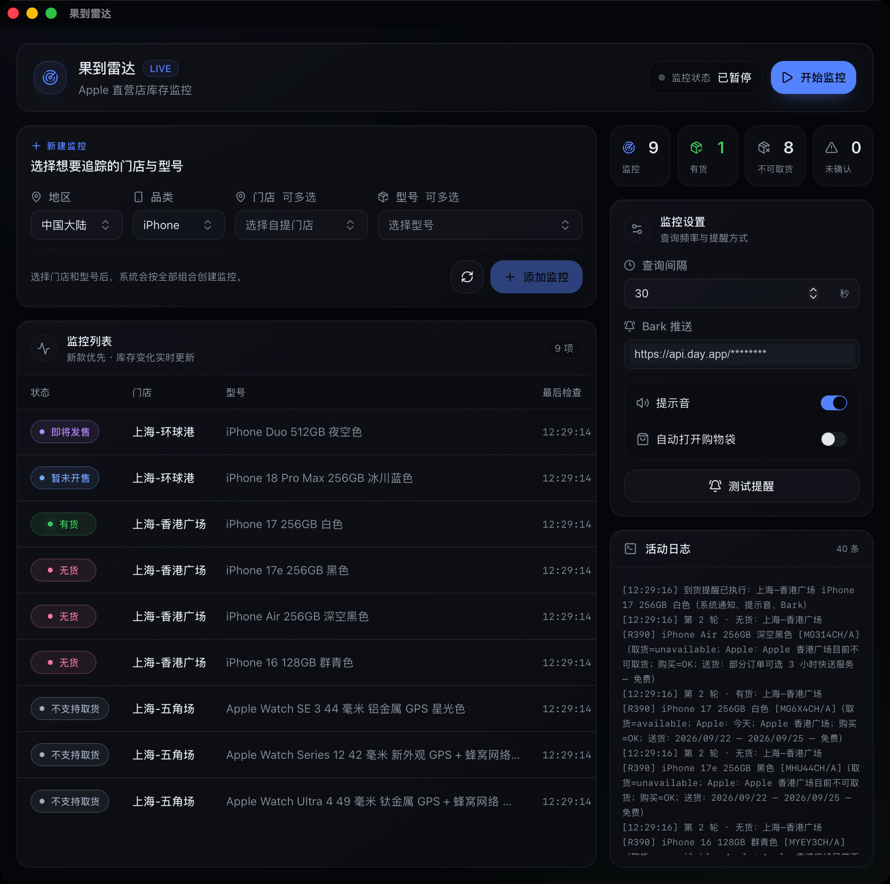

# 果到雷达（Apple Store Inventory Monitor）

[](https://github.com/suversal/apple-store-inventory-monitor/actions/workflows/ci.yml)
[](package.json)
[下载与发布记录](https://github.com/suversal/apple-store-inventory-monitor/releases)
[](LICENSE)

果到雷达是一款 Apple 直营店取货库存监控工具。选好地区、门店和具体型号后，它会定时检查库存；检测到有货时，可以播放提示音、推送 Bark，并按你的选择打开 Apple 购物袋或商品详情。

支持 macOS、Windows 和 Linux，使用 Rust、Tauri 2 和 React 编写。果到雷达的正式版本从 **1.0.0** 开始，本 README 对应 `1.0.4` 源码。英文应用名为 **Apple Store Inventory Monitor**，仓库名为 `apple-store-inventory-monitor`。

基于 [ENCHIGO/apple-pickup-watcher v0.3.2](https://github.com/ENCHIGO/apple-pickup-watcher/tree/v0.3.2) 继续开发，按 GPL-3.0-or-later 发布。来源与修改记录见 [NOTICE](NOTICE)。

> 本项目不是 Apple 官方软件，与 Apple Inc. 没有关系，也没有获得 Apple 授权。它只负责查询和提醒，不能预留库存，也不会替你下单。

[快速开始](#快速开始) · [下载安装](#安装) · [使用方法](#使用方法) · [常见问题](#常见问题) · [从源码运行](#从源码运行) · [反馈问题](#反馈问题)

## 界面预览

V1.0.3


V1.0.0



截图中的 Bark 密钥已遮挡；库存仅代表拍摄时结果。截图来自更新前的本地版本，日志中的旧提醒记录不代表当前版本提供系统通知。当前提醒方式为提示音、Bark 和可选的页面跳转。

## 快速开始

如果你只想使用软件，不需要安装 Rust、Node.js 或 pnpm。它们只供开发者从源码构建。

1. 按下方[安装说明](#安装)下载并安装适合自己电脑的版本。
2. 确认电脑已安装 Google Chrome 或 Microsoft Edge。Linux 也可以使用 PATH 中的 Chromium。Firefox、Safari、Brave 等浏览器目前不能用于库存查询。软件不会读取你平时使用的浏览器资料。
3. 打开果到雷达。macOS 和 Windows 可能会拦截未经公证或没有开发者证书的应用，处理方法见[安装](#安装)。
4. 如果想在 iPhone 上收到到货通知，先按 [Bark 教程](#bark-从下载到使用)安装并配置 Bark；不需要手机推送可以跳过。
5. 选择地区和品类，再勾选门店与型号，点击「添加监控」。
6. 选择提示音、Bark 和「到货后打开」方式，再点一次「测试提醒与跳转」。
7. 确认测试正常后点击「开始监控」。看到「未知」时先看活动日志，不要把它当成无货。

Apple 可能限流或调整接口，库存也可能在提醒后立即变化。最终能否取货，以 Apple 官网下单时的结果为准。

## 运行要求

运行时需要以下任意一种浏览器：

- Google Chrome
- Microsoft Edge
- Chromium（Linux，需要能从 PATH 直接启动）

应用会自动查找常见安装位置。macOS 请把 Chrome 或 Edge 安装在系统的「应用程序」目录（`/Applications`）；放在其他目录可能无法识别。没有找到浏览器时，监控项会显示为「未知」，日志会说明原因。

目前只提供桌面版，不支持 iPhone、iPad 或 Android。Bark 只是把有货消息推送到 iPhone，真正的库存监控仍在电脑上运行。电脑休眠、关机或彻底退出应用后，监控也会停止。

## 安装

打开 [最新正式版本](https://github.com/suversal/apple-store-inventory-monitor/releases/latest)，在 **Assets** 中下载对应系统的安装包。每个版本的变化见 [更新记录](CHANGELOG.md)。

普通用户只需要下表中的安装包，不需要下载 `.sig`、`latest.json`、`.app.tar.gz` 或 GitHub 自动提供的 Source code 压缩包。

| 你的电脑 | 推荐下载 |
| --- | --- |
| Apple 芯片 Mac（M1、M2、M3、M4 等） | 文件名含 `aarch64` 的 `.dmg` |
| Intel 芯片 Mac | 文件名含 `x64` 的 `.dmg` |
| Windows x64（Intel / AMD） | `*-setup.exe` |
| Ubuntu 24.04 或更新的 64 位 Linux | `*_amd64.deb` 或 `*_amd64.AppImage` |

不知道 Mac 使用哪种芯片时，点击屏幕左上角苹果菜单，选择「关于本机」：显示 Apple M 系列就下载 `aarch64`，显示 Intel 就下载 `x64`。

### macOS

1. 打开 `.dmg`，把 `Apple Store Inventory Monitor.app` 拖进「应用程序」，不要直接在磁盘映像中长期运行。
2. 应用包已经过完整的 ad-hoc 签名，但暂未使用 Developer ID 证书，也未经过 Apple 公证。如果系统提示无法验证开发者，可以在 Finder 中按住 Control 点击应用并选择「打开」，或到「系统设置 → 隐私与安全性」确认被拦截的是本应用，再选择「仍要打开」。

`v1.0.2` 的 macOS 包曾因应用签名不完整而被系统误报为“已损坏”，此问题已在 `v1.0.3` 修复。如果新版仍显示旧提示，请先删除旧应用和旧 DMG，确认重新下载的文件名包含 `1.0.4`。确认安装包来自本仓库 Release 后，仍可执行：

```bash
xattr -dr com.apple.quarantine "/Applications/Apple Store Inventory Monitor.app"
```

然后重新打开应用。这条命令只移除该应用的下载隔离标记，不会关闭 macOS 的全局安全功能。不要对来源不明的应用执行这条命令。

### Windows

推荐使用 `*-setup.exe`。未签名版本可能触发 SmartScreen。确认文件来自本仓库 Release 后，可点击「更多信息」，再选择「仍要运行」。Windows 自带 Microsoft Edge，一般不需要另装浏览器。

### Linux

Release 提供 x64 的 `.deb` 和 `.AppImage`。安装包在 Ubuntu 24.04 上构建，需要 glibc 2.39 或更高版本；较老的发行版请从源码构建。

在终端进入安装包所在目录（例如 `cd ~/Downloads`），选择一种方式安装。以下命令中的文件名请替换为实际下载的文件名。

**Debian / Ubuntu：**

```bash
sudo apt install "./Apple.Store.Inventory.Monitor_1.0.4_amd64.deb"
```

`apt` 会同时安装包声明的依赖。音频播放和托盘还需要 ALSA 与 AppIndicator 运行库。

**AppImage：**

```bash
chmod +x "./Apple.Store.Inventory.Monitor_1.0.4_amd64.AppImage"
"./Apple.Store.Inventory.Monitor_1.0.4_amd64.AppImage"
```

AppImage 需要 FUSE 2。Ubuntu 24.04 可以用 `sudo apt install libfuse2t64` 安装；也可以不安装 FUSE，直接解包运行：

```bash
"./Apple.Store.Inventory.Monitor_1.0.4_amd64.AppImage" --appimage-extract-and-run
```

Linux 还需要自行安装 Chrome、Edge 或 Chromium。使用 Chromium 时，请确认终端可以运行 `chromium` 或 `chromium-browser`。

## 功能

- 支持 iPhone、iPad、Mac 和 Apple Watch。
- 内置中国大陆、中国香港、中国台湾、日本、新加坡、澳大利亚和马来西亚的 Apple Store 列表。
- 门店和型号都可以多选，添加时会自动生成全部组合。
- 同一门店的多个型号合并查询，减少不必要的请求。
- iPhone 型号选择和监控列表按代际优先显示新款；型号名称保留可确认的容量、颜色和规格。
- 区分有货、无货、不支持取货、暂未开售、即将发售和暂不可购买，分别使用独立配色；查询失败保留为未确认状态。
- 支持提示音和 Bark 推送；可为不同型号指定不同的 Bark 地址，把到货消息分发给不同的人。
- 有货时可以选择不自动打开页面、打开对应地区的 Apple 购物袋，或打开对应型号的商品详情；也可以点击监控列表中的型号手动打开商品详情。
- 窗口关闭后可继续在系统托盘运行。
- 型号目录可以从 Apple 官网刷新；网络失败时仍可使用内嵌目录。
- 活动日志逐轮显示每项状态、门店编号、商品零件号及 Apple 返回的取货、购买和配送说明，并按状态汇总。
- 支持应用内检查更新。

## 使用方法

下面按照第一次使用的顺序操作。Bark、提示音和自动打开页面都是可选项，至少配置一种自己需要的提醒方式即可。

### 第一步：打开应用并做好准备

1. 先正常打开一次 Chrome 或 Edge，确认它能访问 Apple 官网；Linux 也可以使用 Chromium。
2. 再打开果到雷达，等待界面显示地区、品类和门店选项。
3. 如果需要手机通知，先在 iPhone 上配置 Bark；如果只需要电脑播放提示音，可以跳过 Bark。

果到雷达必须在电脑上保持运行。Bark 只负责把通知送到 iPhone，不能代替电脑查询库存。电脑睡眠、关机或彻底退出果到雷达后，监控都会停止。

### 第二步：添加要监控的商品

1. 选择地区和品类。
2. 在门店下拉框中勾选一家或多家门店。
3. 在型号下拉框中搜索并勾选一个或多个具体配置。容量、颜色、尺寸或连接类型不同，会被视为不同型号。
4. 点击「添加监控」。

门店和型号会按组合添加。例如，选择 2 家门店和 3 个型号，会生成 6 条监控。已存在的组合会被跳过。

找不到刚发布的型号时，点击「添加监控」旁边的刷新按钮。刷新会从当前地区的 Apple 官网重新获取型号目录，但不会替换已经保存的监控项。机型出现在列表中不代表它已经开放预购或门店取货；旧型号已下架或 Apple 暂时没有取货数据时，可能显示「暂无数据」。

切换地区会清空上方尚未添加的门店和型号选择，但不会删除已经在监控列表中的项目。

### 第三步：选择到货后的提醒方式

- **提示音**：打开后，电脑检测到有货时会播放声音。请确保系统没有静音。
- **默认 Bark 推送**：适合把所有商品的提醒发送到同一台 iPhone。
- **型号专属 Bark**：适合把某个型号的提醒发送给其他人，或者发送到另一台 iPhone。
- **到货后打开**：可以选择「不自动打开」「购物袋」或「商品详情」。这些选项只负责打开页面，不会自动加入购物袋、预留库存或下单。

持续有货时，每一轮都会再次执行已经开启的提醒。如果不想浏览器反复出现新页面，请把「到货后打开」设为「不自动打开」。

### Bark 从下载到使用

Bark 是一款把自定义通知推送到 iPhone 或 iPad 的独立应用。它不是必需组件：不使用 iPhone，或者只想听电脑提示音时，可以完全跳过这一节。

#### 1. 在 iPhone 上下载 Bark

打开 [App Store 中的 Bark](https://apps.apple.com/cn/app/bark-%E7%BB%99%E4%BD%A0%E7%9A%84%E6%89%8B%E6%9C%BA%E5%8F%91%E6%8E%A8%E9%80%81/id1403753865)，或者在 App Store 搜索完整名称 **“Bark - 给你的手机发推送”**。安装后打开 Bark，并允许它发送通知。Bark 的源代码和官方说明可在 [Finb/Bark](https://github.com/Finb/Bark) 查看。

#### 2. 找到自己的 Bark 推送地址

打开 Bark 首页，找到并复制它显示的推送地址或测试 URL。果到雷达需要的是“服务器地址 + 设备 Key”，通常形如：

```text
https://api.day.app/你的设备Key
```

如果 Bark 显示的是下面这种带测试文字的完整地址：

```text
https://api.day.app/你的设备Key/这里改成你自己的推送内容
```

只把前半段 `https://api.day.app/你的设备Key` 填入果到雷达，不要把最后的测试文字一起粘贴。使用自建 Bark 服务器时规则相同：地址必须以 `http://` 或 `https://` 开头，并且路径中包含设备 Key。

设备 Key 相当于这台设备的推送凭证。不要把真实地址发到群聊、截图、公开 Issue 或代码仓库中。

#### 3. 填入果到雷达

1. 回到电脑上的果到雷达。
2. 在右侧「默认 Bark 推送」输入框粘贴地址。
3. 点击输入框外的空白位置，让设置保存。
4. 如果所有型号都推送到同一台手机，到这里就配置完成了。

想让某个型号推送给另一台手机时，先添加该型号的监控，再点击监控列表 Bark 一栏中的「默认」，在弹窗中填写另一条 Bark 地址并保存。按钮会变成「专属」。同一型号即使监控多家门店，也共用这一条专属地址；清空专属地址并保存，就会恢复使用默认 Bark。

#### 4. 先测试，再开始监控

点击「测试提醒与跳转」，然后检查：

1. iPhone 是否收到标题为“提醒测试（不代表有货）”的通知。
2. 果到雷达活动日志是否显示 Bark 已执行，还是给出了失败原因。
3. 如果配置了型号专属 Bark，测试会使用监控列表中第一个型号的地址；因此测试专属地址前，应先把对应型号添加到列表。

测试按钮不会查询 Apple 库存，也不代表商品有货。只有手机实际收到通知，才能确认 Bark 链路已经可用。

### 第四步：测试其他提醒和页面跳转

「测试提醒与跳转」还会测试当前开启的提示音和「到货后打开」选项：

- 选择「购物袋」时，会打开当前地区的 Apple 购物袋。
- 选择「商品详情」时，需要先添加监控目标；测试会打开列表中第一个型号的商品页。
- 选择「不自动打开」时，不会打开浏览器，Bark 通知中也不会附带页面链接。

如果只想测试某一项，可以暂时关闭其他提醒。测试完成后，再恢复自己真正需要的设置。

### 第五步：开始监控

1. 点击右上角「开始监控」。
2. 等待第一轮完成，在监控列表和活动日志中查看每个项目的结果。
3. 需要暂时停止查询时，点击「暂停监控」。
4. 关闭主窗口后，应用会留在系统托盘继续运行；需要完全退出时，请从托盘菜单选择「退出」。

重新打开应用会恢复已保存的监控列表，但需要再次点击「开始监控」。

### 查看结果

监控列表中的「最后检查」表示该条目最近一次完成查询的时间。活动日志会在每轮结束后显示类似内容：

```text
第 2 轮 · 无货：上海-香港广场 [R390] iPhone Air…（取货=unavailable；购买=OK…）
第 2 轮 · 不支持取货：上海-五角场 [R581] Apple Watch…（取货=ineligible…）
第 2 轮 · 有货：上海-环球港 [R683] iPhone 17…（取货=available；Apple：今天…）
第 2 轮完成（4.4 秒）：无货 1 项、不支持取货 1 项、有货 1 项。约 30 秒后查询。
```

第一条商品有货不会停止本轮查询。监控引擎会继续处理剩余门店和型号；持续有货时，每一轮都会再次执行已启用的提醒动作。

### 查询间隔

默认基础间隔为 30 秒，界面允许的下限是 5 秒。日常使用建议保留 30 秒或更长，避免频繁请求触发 Apple 风控。

间隔从本轮查询结束后开始计算，并有 ±20% 的随机浮动。例如，基础间隔为 30 秒时，正常情况下会在本轮结束后约 24～36 秒开始下一轮；整轮查询本身的耗时另计。

整轮全部失败时，等待时间会逐步延长到基础间隔的 2、4、8 倍，再叠加随机浮动。界面倒计时和日志中的「约 N 秒」按基础间隔估算，实际时间可能更长，尤其是在多门店查询或连续失败时。

### 应用更新

应用启动后会静默检查 GitHub Releases。发现新版本时，界面会显示版本号和「下载并安装」按钮；更新不会在后台自动安装。更新时会显示累计下载量，以及验证、安装阶段；安装完成后需要重启应用，再点击「开始监控」。失败时会显示原因并提供重试或完整安装包入口。签名验证失败会停止安装，不会跳过验证；遇到签名密钥不匹配时请下载完整安装包替换旧版。

macOS 应用包使用完整的 ad-hoc 签名，但没有 Developer ID 证书且尚未公证；Windows 安装包也没有操作系统层面的开发者证书，因此仍可能出现 Gatekeeper 或 SmartScreen 提示。自动更新包另行使用本项目独立的 Tauri 更新密钥签名，用于阻止应用安装被篡改的更新包。

## 状态与颜色说明

同一种状态使用相同颜色，不同业务状态使用独立配色；深色和浅色主题都保留文字标签，便于直接辨认。

| 状态 | 颜色 | 含义 | 是否到货提醒 |
| --- | --- | --- | --- |
| 待查询 | 淡灰、虚线边框 | 尚未完成首次查询 | 否 |
| 有货 | 绿色 | Apple 返回 `available`，所选门店可取货 | 是，每轮确认有货都会提醒 |
| 无货 | 粉红色 | Apple 返回 `unavailable`，所选门店当前不可取货 | 否 |
| 不支持取货 | 石板灰 | Apple 返回 `ineligible`，当前商品或购买组合不适用取货服务，不能据此认定门店库存为零 | 否 |
| 暂未开售 | 蓝色 | `NOT_FOR_SALE` 且 Apple 文案明确说明尚未发售 | 否 |
| 即将发售 | 紫色 | Apple 返回 `COMING_SOON`，不代表已经可以下单 | 否 |
| 暂不可购买 | 金黄色 | `NOT_FOR_SALE`，但没有明确的尚未发售文案 | 否 |
| 未确认结果 | 橙色 | 根据原因显示「暂无取货数据」「未返回型号」「请求被拦截」「请求被限流」「查询失败」等，不能当作无货 | 否 |

取货、购买和配送是独立信息：购买状态 `OK` 不代表门店有货；配送日期也不是门店可取货日期。`SELL_IN_KIT_ONLY_RESTRICTION` 是购买限制字段，仅凭它不能判断门店库存或认定全部购买组合都不支持取货，请到官网核对完整配置。

有货以明确的取货结果为准，不会被送货说明覆盖。概览中的「不可取货」合计包括无货、不支持取货及尚不可购买的项目；「未确认」表示本轮没有可信结论。请结合逐项标签和日志查看具体原因。

### 为什么会有「未知」或未确认结果

查询失败和无货是两回事。请求被拦截、超时、限流、响应解析失败，以及 Apple 没有返回对应门店或型号的数据，都不能确认库存。程序会保留具体原因；遇到「暂无取货数据」或「未返回型号」时，请刷新型号目录并核对官网是否仍销售该型号、是否已开放取货。

## 设置与数据

新包使用独立的应用标识 `com.suversal.apple-store-inventory-monitor` 和配置目录。
首次启动时会从改名前的 `apple-pickup-watcher` 目录读取并复制现有设置；旧文件不会
被修改或删除，旧包仍可读取原有设置。迁移后两套配置独立，新版中新增或修改的监控项不会同步回旧包。

| 系统 | 设置文件 |
| --- | --- |
| macOS | `~/Library/Application Support/apple-store-inventory-monitor/settings.v2.json` |
| Windows | `%APPDATA%\apple-store-inventory-monitor\settings.v2.json` |
| Linux | `~/.config/apple-store-inventory-monitor/settings.v2.json`；设置了有效的绝对路径 `$XDG_CONFIG_HOME` 时，改用该目录下的 `apple-store-inventory-monitor/settings.v2.json` |

设置文件包含监控目标、查询间隔和提醒选项。Bark 地址也会保存在本机，请不要将该文件上传到公开 issue 或提交进 Git 仓库。

项目没有接入分析统计或崩溃上报。正常运行时会访问 Apple 官网；启用 Bark 时会访问用户填写的 Bark 服务；检查更新时会访问本仓库的 GitHub Releases。

## 常见问题

### 找不到安装包

先确认打开的是本仓库的 [Releases](https://github.com/suversal/apple-store-inventory-monitor/releases)，再展开对应版本的 Assets。只有源码标签或 Actions 构建记录，不代表安装包已经公开；草稿 Release 对普通访问者不可见。请等待正式发布，或按[从源码运行](#从源码运行)自行构建。

### 出现 HTTP 541

`541` 表示这次请求没有取得可信的库存结果，不代表无货。程序会把对应条目标为「未知」，并在下次查询时重建浏览器会话。

如果连续多轮仍然失败：

1. 确认 Chrome 或 Edge 可以正常打开 Apple 官网。
2. 暂停监控并重启应用。
3. 保持默认查询间隔，不要连续快速启停。
4. 对照 Apple 官网，并尝试其他网络排除本地网络问题。

### 官网有货，应用却显示无货

先核对门店、容量、颜色和零件号是否完全一致。Apple 的网页可能默认切换到附近门店，也可能显示另一种配置。若应用显示的是「未知」，应先处理日志中的错误，不能把未知当成无货。

### 为什么必须安装 Chrome 或 Edge

库存查询依赖 Apple 商品页完成的浏览器校验。Tauri 自带的 WebView 和普通 HTTP 请求在当前流程下无法稳定取得库存 JSON，因此应用使用独立 Chromium 会话。

### 提示“浏览器会话未能完成本次 Apple 查询”

这表示果到雷达没有成功建立用于查询库存的临时浏览器会话，不等同于商品无货。请依次检查：

1. Windows 是否安装了 Chrome 或 Edge；macOS 是否把 Chrome 或 Edge 放在系统的「应用程序」目录；Linux 是否能从终端运行 Chrome、Edge 或 Chromium。
2. Firefox、Safari、Brave、360 浏览器等目前不能替代 Chrome、Edge 或 Chromium。
3. 把受支持的浏览器升级到当前版本，手动打开一次并确认可以访问 Apple 官网。
4. 完全退出果到雷达后重新打开。如果仍然立即失败，再检查安全软件是否阻止了浏览器的无界面进程。

### 测试提醒没有声音或 Bark 推送

提示音请检查应用内开关、系统音量和音频输出设备。Bark 请先确认 Bark 自己的测试 URL 能让手机收到通知，再检查果到雷达中填写的地址是否只包含服务器和设备 Key、iPhone 是否允许 Bark 通知，以及专注模式是否隐藏了普通通知。最后查看活动日志中的 Bark 失败原因。两条提醒渠道独立，提醒失败不会改变库存判断。

### 关闭窗口后应用没有退出

这是预期行为。关闭窗口会收进系统托盘，监控继续运行。需要彻底退出时，在托盘菜单中选择「退出」。

### 电脑锁屏后还会监控吗

只锁屏通常不会停止应用，但电脑进入睡眠、关机或应用被彻底退出后不会继续查询。长时间监控时，请接通电源并按自己的需要调整系统睡眠设置。

## 相比直接上游，我们做了什么

下面只比较本项目与直接上游 `ENCHIGO/apple-pickup-watcher v0.3.2` 的差异。Rust、Tauri、三态库存、四个产品品类、系统托盘和应用内更新等能力已经由上游完成，不算作本项目新增。

| 项目 | 直接上游 v0.3.2 | 果到雷达 v1.0.4 |
| --- | --- | --- |
| Apple 查询会话 | 普通 HTTP 客户端先访问商品页获取 Cookie，再查询库存 | 启动独立的临时 Chromium 会话，在 Apple 页面环境中完成校验和库存请求；遇到 `403` 或 `541` 时销毁会话，下次查询时重建 |
| 批量添加监控 | 每次选择一家门店和一个型号 | 门店、型号都可以多选，一次生成全部组合；重复组合会自动跳过 |
| 持续有货提醒 | 只在状态从非有货变成有货时提醒一次 | 每轮确认有货都会重新执行提醒，适合库存短暂出现、第一次错过提醒等情况 |
| 运行过程反馈 | 主要记录状态变化，长时间无变化时不容易判断是否仍在查询 | 每轮显示覆盖的门店和监控项、逐项结果、耗时与预计等待时间；日志最多保留 300 行 |
| 操作反馈 | 有货时会执行提醒并尝试打开购物袋，但界面不显示具体执行结果 | 可选择打开购物袋或商品详情，记录已执行的提醒动作，并显示提示音、Bark 或页面打开失败的错误；实际送达情况仍需在设备上确认 |

这些调整用于改善库存查询、批量添加和长时间监控时的反馈。逐项修改记录见 [NOTICE](NOTICE)。

## Apple 查询会话

Apple 当前商品页会先完成浏览器环境校验，再请求库存接口。普通 HTTP 客户端即使带上常见请求头和购物袋 Cookie，也可能收到 `HTTP 541`。

果到雷达会启动一个独立的无界面 Chromium 会话（Chrome、Edge，或 Linux 上的 Chromium）：

1. 创建临时浏览器资料目录。
2. 打开当前地区的 Apple 正式购买页，等待页面校验完成。
3. 在同一页面和同一会话中请求库存。
4. 多个门店串行查询，任意两次请求至少间隔 2 秒。
5. 如果会话被 `403` 或 `541` 拒绝，销毁当前会话，下次查询时重新建立。

临时浏览器不会读取用户日常使用的 Chrome/Edge 个人资料、Cookie 或浏览记录。应用正常退出时会清理临时进程和资料目录。

## 从源码运行

### 工具链

- Rust 1.90 或更高版本
- Node.js 22.12+ 的 LTS 版本；Vite 7 也支持 Node.js 20.19+（20.x），不支持 22.0～22.11
- pnpm 9 或更高版本
- 对应平台的 Tauri 2 系统依赖
- Chrome、Edge 或 Linux 上的 Chromium，用于真实库存查询

macOS 需要 Xcode Command Line Tools：

```bash
xcode-select --install
```

Windows 需要 Microsoft C++ Build Tools，并在安装器里选择「使用 C++ 的桌面开发」。还需要 WebView2 Runtime，Windows 11 通常已经自带。

Debian/Ubuntu 构建依赖：

```bash
sudo apt update
sudo apt install -y \
  libwebkit2gtk-4.1-dev libgtk-3-dev build-essential curl wget file \
  libxdo-dev libssl-dev libayatana-appindicator3-dev librsvg2-dev \
  libasound2-dev patchelf xdg-utils
```

其他 Linux 发行版的包名不同，请对照 [Tauri 2 前置依赖文档](https://v2.tauri.app/start/prerequisites/)。

### 开发命令

macOS / Linux：

```bash
git clone https://github.com/suversal/apple-store-inventory-monitor.git
cd apple-store-inventory-monitor
pnpm install
source "$HOME/.cargo/env"
pnpm tauri dev
```

Windows PowerShell（安装 Rust 后请重新打开终端）：

```powershell
git clone https://github.com/suversal/apple-store-inventory-monitor.git
cd apple-store-inventory-monitor
pnpm install
cargo --version
pnpm tauri dev
```

只启动前端页面可以运行 `pnpm dev`，但浏览器页面无法调用 Tauri 命令，不能据此验证真实监控功能。

### 检查与测试

确认当前终端能运行 `cargo --version` 后，在仓库根目录执行。以下命令适用于 macOS、Linux 和 Windows PowerShell：

```text
cargo fmt --all -- --check
cargo clippy --workspace --all-targets --all-features -- -D warnings
cargo test --workspace
pnpm build
pnpm test
```

离线测试不会请求 Apple。真实接口回归测试需要本机安装支持的 Chromium 浏览器，并会访问 Apple 官网：

```text
cargo test -p apple-store-inventory-monitor "chromium_fetcher::tests::真实chromium会话连续检查四家门店两轮" -- --ignored --nocapture
```

这条测试会复用同一浏览器会话，连续检查上海四家门店两轮。它用于验证页面校验、会话复用、请求节流、响应解析，以及第一家门店有货后仍继续查询其他门店。

### 开发排障

#### 启动开发版时报 `failed to run cargo metadata`

先运行 `cargo --version`，确认终端能找到 Rust。macOS / Linux 若找不到 Cargo，可先载入环境：

```bash
source "$HOME/.cargo/env"
pnpm tauri dev
```

如果 `~/.cargo/bin/cargo` 不存在，需要先安装 Rust。Windows 请安装 Rust 后重新打开 PowerShell，确认 `%USERPROFILE%\.cargo\bin` 已加入 PATH。

如果 Cargo 可以正常运行，应继续查看完整错误中的 manifest、依赖解析或工具链提示；`failed to run cargo metadata` 不一定是未安装 Rust。

#### 源码目录改名后，构建日志仍指向旧目录

Cargo 的 `target` 目录可能保留了旧项目的绝对路径。典型报错是当前正在构建 `apple-store-inventory-monitor`，却去另一个旧目录读取 Tauri 的 `permissions` 文件。

在仓库根目录执行：

```bash
cargo clean
pnpm tauri dev
```

执行前先检查 `CARGO_TARGET_DIR` 和 `.cargo/config.toml`：`cargo clean` 会清理实际目标目录中的编译产物；若多个项目共用该目录，也会清掉它们的缓存。它不会删除源码或用户设置。

### 构建应用

本地构建但不生成发布签名：

```bash
pnpm tauri build --no-sign
```

产物位于 `target/release/bundle/`。自动更新包需要仓库维护者配置 `TAURI_SIGNING_PRIVATE_KEY`；私钥设置了密码时还要配置 `TAURI_SIGNING_PRIVATE_KEY_PASSWORD`。没有私钥时不能生成可被现有客户端验证的更新签名。

正式版本由 [Release 工作流](.github/workflows/release.yml) 构建，标签使用 `v1.0.4` 这样的格式。发版前应确认 `package.json`、工作区 `Cargo.toml`、`src-tauri/tauri.conf.json` 与标签的版本一致。macOS 专用配置在 `src-tauri/tauri.macos.conf.json` 中启用 ad-hoc 签名；发布流水线会同时验证自动更新归档和 DMG 内的应用签名。

推送 `v*` 标签后，GitHub Actions 会生成 macOS、Windows 和 Linux 安装包，并先创建草稿 Release；确认四个平台全部成功后再公开发布，避免用户下载到缺少部分平台或 `latest.json` 尚未完整生成的版本。手动运行 `workflow_dispatch` 只生成 Actions 构建产物，不会创建公开 Release。

## 代码结构

```text
crates/apw-core/src/
  apple.rs                HTTP 错误分类与库存响应解析
  apple_catalog.rs        从 Apple 购买页解析型号目录
  catalog.rs              在线目录与内嵌快照
  config.rs               设置保存、迁移与损坏保护
  model.rs                地区、商品、门店和三态库存模型
  notify.rs               Bark 与提示音
  watcher.rs              监控调度、分组查询、事件与退避

src-tauri/
  src/chromium_fetcher.rs  临时 Chromium 会话与真实库存请求
  src/lib.rs               Tauri 命令、托盘、更新和通知装配

src/
  App.tsx                  主界面
  components/              界面组件
  lib/store.ts             前端状态与事件日志
  lib/types.ts             Rust/TypeScript 边界类型
  lib/monitorLog.ts        业务状态、配色语义与逐轮日志
  lib/productOrder.ts      新款优先排序
  lib/updateStatus.ts      更新进度与失败原因
```

库存是否可取货只由 Rust 核心判断。前端负责展示状态，不会根据日志文本或空响应自行推断「无货」。

## 最近一次真实验证

2026-09-10 使用本次完整源码，通过同一个临时 Chromium 会话查询 iPhone 17 256GB 白色（`MG6X4CH/A`），对上海以下四家门店连续查询两轮：

- R390 香港广场
- R401 上海环贸 iapm
- R581 五角场
- R683 环球港

8 次查询均返回明确库存状态；官网目录刷新同时识别出 6 个 iPhone 机型页、取得 73 个 SKU。首次新建会话曾被 Apple 风控拦截，间隔后重建会话的复测通过，说明仍需保留失败提示与重试。真实库存随时变化，这项验证只代表当次结果，不保证持续可用或这些门店当前仍有货。

## 来源与许可

本仓库直接基于 [ENCHIGO/apple-pickup-watcher](https://github.com/ENCHIGO/apple-pickup-watcher)
`v0.3.2` 继续开发，并保留了对应 Git 历史。主要后续改动包括多门店与多型号组合监控、逐项轮次日志、重复提醒、临时 Chromium 查询会话、独立应用标识，以及「果到雷达」这一对外名称。

`ENCHIGO/apple-pickup-watcher` 是 [hteen/apple-store-helper](https://github.com/hteen/apple-store-helper)
的 GPL-3.0 重写版本。因此，本项目既保留直接上游 ENCHIGO 的贡献记录，也继续遵守最初项目的 GPL-3.0 派生要求。版权、承继资源和逐项修改说明见 [`NOTICE`](NOTICE)。

本项目按 [GNU General Public License v3.0 or later](LICENSE) 发布。分发修改版本时，需要继续遵守 GPL-3.0 的源码和许可要求。

## 反馈问题

请在本仓库的 [Issues](https://github.com/suversal/apple-store-inventory-monitor/issues) 提交问题，并尽量附上：

- 操作系统与芯片架构，例如 macOS 26 / Apple M4；
- 应用版本；
- 地区、门店和商品品类；
- 活动日志中的完整错误文字；
- 问题能否稳定复现。

提交前请删掉 Bark 地址、设备 Key、个人路径及其他隐私信息。库存随时会变化，单独一张「有货」或「无货」截图通常不足以定位问题。
